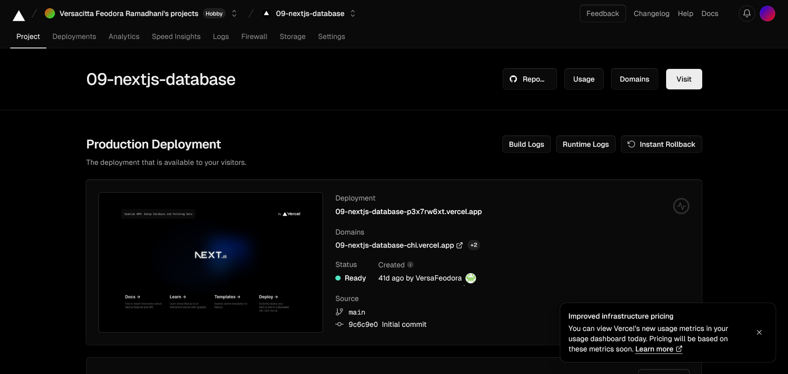
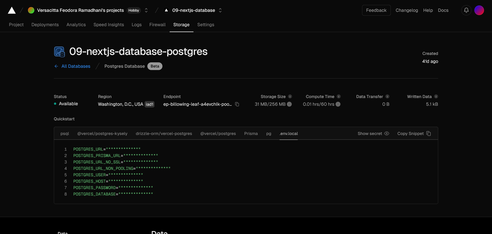
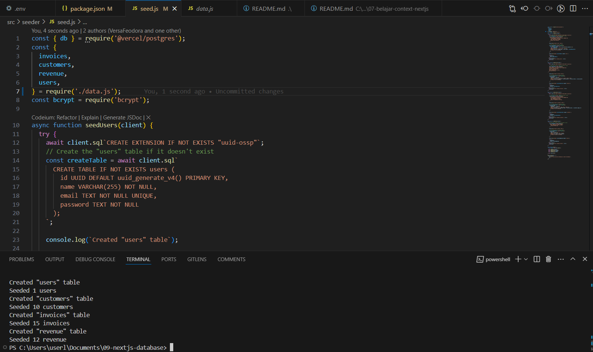

## Laporan Praktikum

|  | Pemrograman Berbasis Framework 2024 |
|--|--|
| NIM |  2141720156|
| Nama |  Versacitta Feodora Ramadhani |
| Kelas | TI - 3I |

### Practicum 1
1.  
From the practicum above, we can deploy our own dynamic React application in robust infrastructure. We can do so by using Github, 
ensuring automatic update in Vercel app everytime we push it to the main branch

2.  
We can use in-bult Serverless SQL Database in Vercel and connect it to our poject in Vercel by inputting API key into .env.

3.  
We can add our database through seeder within React app by using `npm run seed`. In this way, we do not need to insert the database
manually everytime we want to deploy the application. We use dotenv and bcrypt module for this.