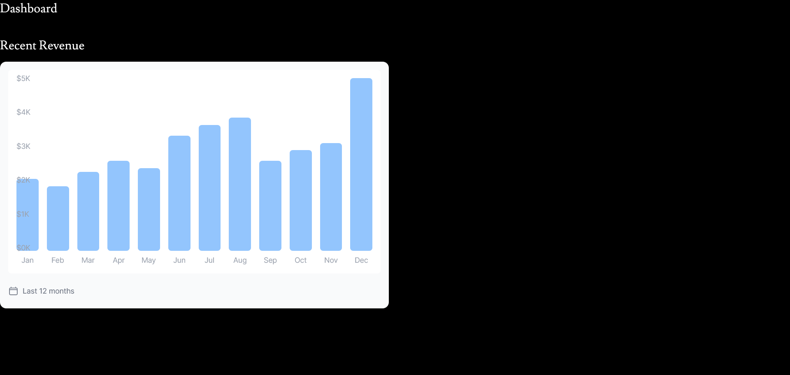
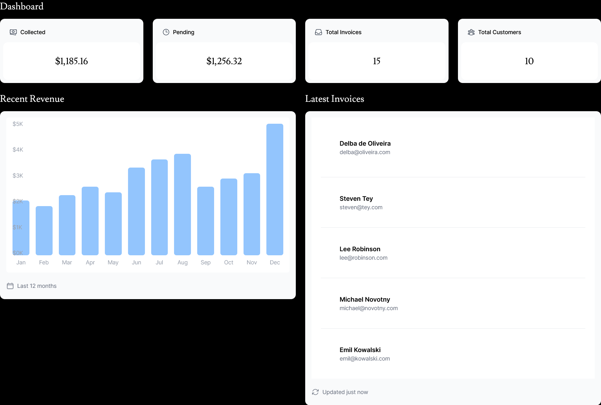

## Laporan Praktikum

|  | Pemrograman Berbasis Framework 2024 |
|--|--|
| NIM |  2141720156|
| Nama |  Versacitta Feodora Ramadhani |
| Kelas | TI - 3I |

### Practicum 1
1.  
From the practicum above, we can deploy our own dynamic React application in robust infrastructure. We can do so by using Github, 
ensuring automatic update in Vercel app everytime we push it to the main branch

2.  
We can use in-bult Serverless SQL Database in Vercel and connect it to our poject in Vercel by inputting API key into .env.

3.  
We can add our database through seeder within React app by using `npm run seed`. In this way, we do not need to insert the database
manually everytime we want to deploy the application. We use dotenv and bcrypt module for this.

4.  
We can use query statement to retrieve the data from database within Vercel just like any SQL-based database does.
In this query statement, we could find the invoice amount along with customer name that has been joined under the same table.

### Practicum 2
5.  
`https://09-nextjs-database-chi.vercel.app/` 
As we pushed the update of the main page in our app to Github, the deployed app in Vercel will also get updated. However, since most of the lines are commented, only the title `Dashboard` appears instead.

6.  
A new chart is created by utilizing style attributes in `div` component, ensuring that data that are retrieved from Postgres db are visualized into the chart. This can be done by reiterating each of the month, then determine its height from database.

7.  
By implementing the same method from the chart component, we can create a list of users into our application by using Postgres db. However, each of their image url is supposed to be inside `public/customers` folder, and said images are not given in template. We need to add it ourselves to make it appears.

### Practicum
1.  
Rather than calling each of the card, we could utilize the CardWrapper as default function in Card Component to implement the parameter from `fetchData` async function into the cards instead, just like the logic behind the chart and the list. This way, the code in `page.tsx` will be neater.

2.  
The function is running asyncronously in order to retrieve statistic data from Posgres DB. Through SQL query statement, it retrieves the amount of invoices, customers, and total invoice based on their status (paid and pending), before they return it as formatted string number.